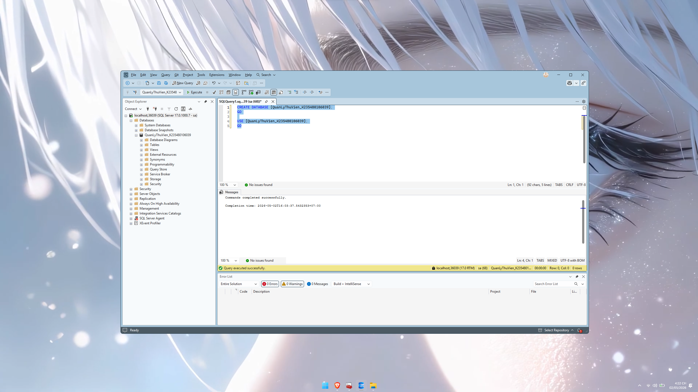

# BÀI KIỂM TRA SỐ 2 - HỆ QUẢN TRỊ CSDL

## Thông tin sinh viên

  -Họ tên: TRẦN TÙNG LÂM
  -Mã SV: K235480106039
  -Chủ đề: Quản lý thư viện

  ---

# PHẦN 1: THIẾT KẾ DATABASE

## Ảnh 1: Tạo Database

- Lệnh SQL:

```sql
CREATE DATABASE [QuanLyThuVien_K235480106039];
GO
USE [QuanLyThuVien_K235480106039];
GO
```

- Mục đích: tạo cơ sở dữ liệu cho hệ thống quản lý thư viện
- Kết quả: database được tạo thành công



## Ảnh 2: Tạo bảng DocGia

- Lệnh SQL:

```sql
CREATE TABLE [DocGia] (
    [maDocGia] INT IDENTITY(1,1) PRIMARY KEY, -- (PK) Khóa chính định danh độc giả
    [tenDocGia] NVARCHAR(100) NOT NULL,       -- Chuỗi ký tự Unicode (hỗ trợ tiếng Việt)
    [ngaySinh] DATE,                          -- Kiểu ngày tháng
    [diemTinNhiem] FLOAT                      -- Kiểu số thực
        CHECK ([diemTinNhiem] >= 0.0 AND [diemTinNhiem] <= 10.0) -- (CK) Ràng buộc cứng: Điểm chỉ từ 0 đến 10
);
GO
```
- Mục đích: bảng độc giả
- Kết quả: bảng được tạo thành công

---

## Ảnh 3: Tạo bảng Sach

```sql
CREATE TABLE [Sach] (
    [maSach] INT IDENTITY(1,1) PRIMARY KEY, -- (PK) Khóa chính định danh sách
    [tieuDeSach] NVARCHAR(200) NOT NULL,    -- Chuỗi ký tự Unicode
    [giaBia] MONEY,                         -- Kiểu tiền tệ
    [soLuongTon] INT                        -- Kiểu số nguyên
        CHECK ([soLuongTon] >= 0)           -- (CK) Ràng buộc cứng: Số lượng không được âm
);
GO
```
- Mục đích: lưu thông tin sản phẩm
- Ràng buộc:
  - PK: MaSP
  - CHECK: Giá > 0

## Ảnh 4: Tạo bảng PhieuMuon

```sql
CREATE TABLE [PhieuMuon] (
    [maPhieu] INT IDENTITY(1,1) PRIMARY KEY, -- (PK) Khóa chính của phiếu mượn
    [maDocGia] INT NOT NULL,                 -- Sẽ dùng làm FK
    [maSach] INT NOT NULL,                   -- Sẽ dùng làm FK
    [ngayMuon] DATE DEFAULT GETDATE(),       -- Kiểu ngày tháng (mặc định là ngày hiện tại)
    [tienDatCoc] MONEY,                      -- Kiểu tiền tệ
    [soNgayMuon] INT                         
        CHECK ([soNgayMuon] > 0 AND [soNgayMuon] <= 30), -- (CK) Ràng buộc cứng: Chỉ được mượn từ 1 đến 30 ngày
```

- Mục đích: lưu thông tin đơn hàng
- Ràng buộc:
  - PK: MaDH
  - CHECK: TongTien > 0
