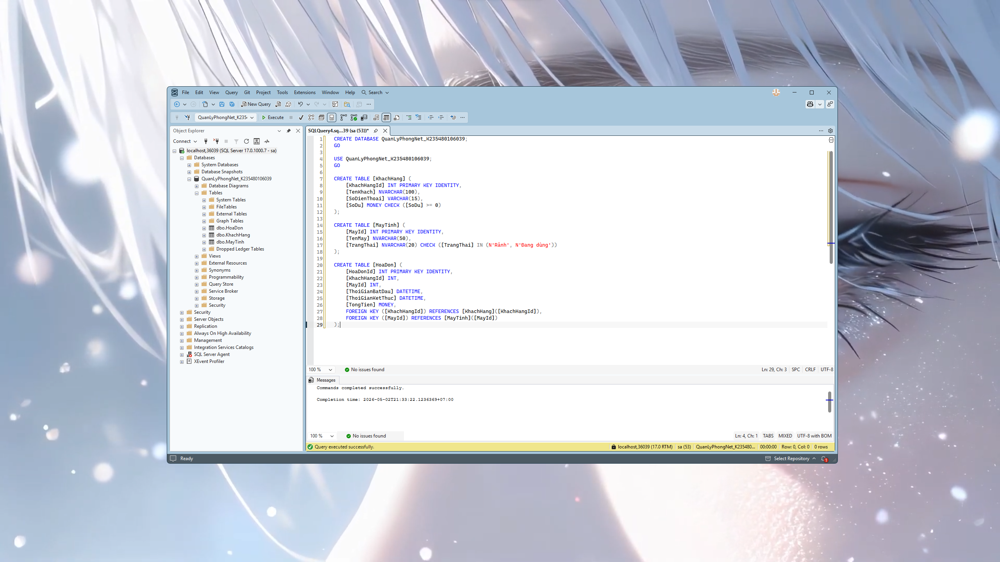
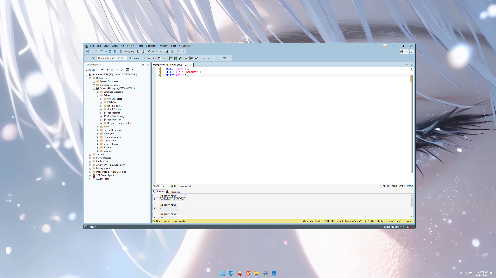
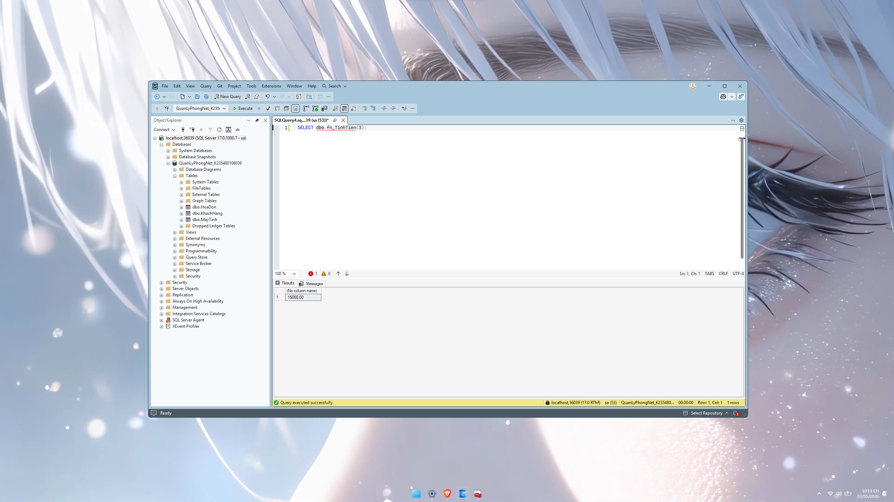
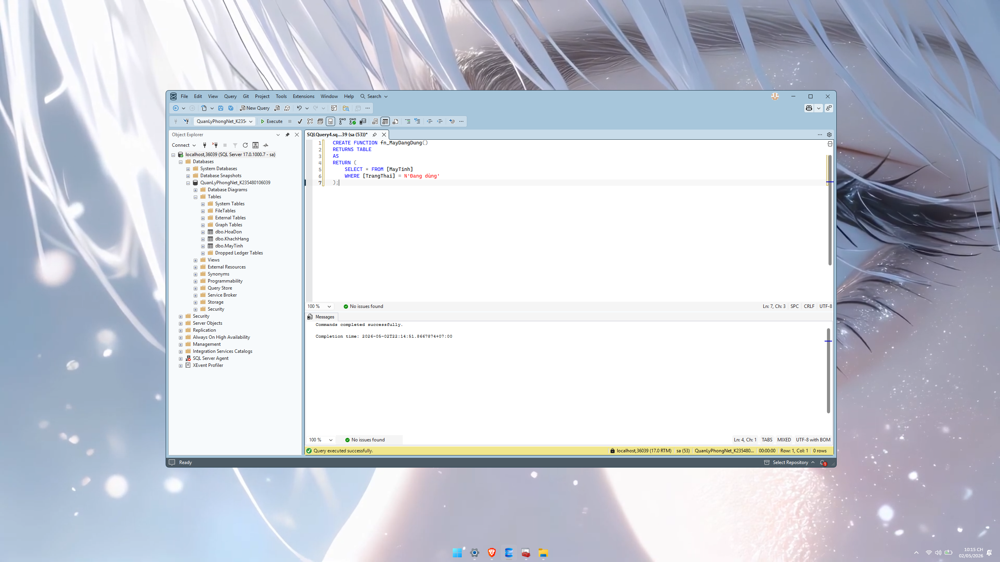
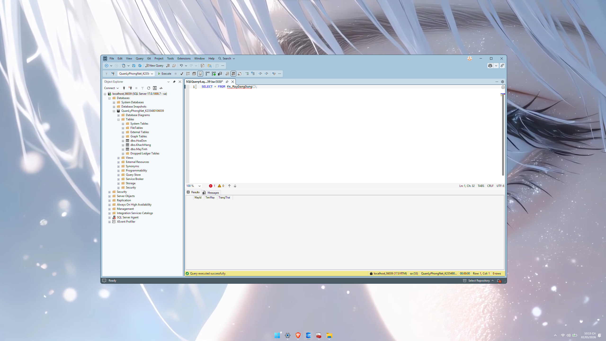
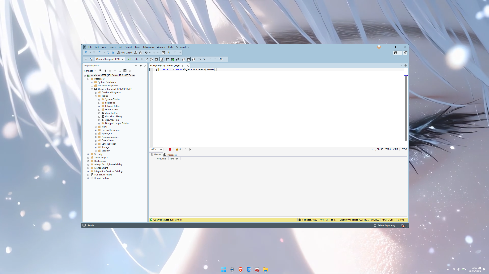

# 📘 BÀI TẬP 02 - SQL SERVER

## 🔰 Thông tin sinh viên

* Họ tên: *[TRẦN TÙNG LÂM]*
* Mã sinh viên: **K235480106039**
* Môn học: Cơ sở dữ liệu
* Chủ đề: **Quản lý phòng Net**

---

## 🧾 Mô tả bài toán

Hệ thống quản lý phòng Net gồm các chức năng:

* Quản lý khách hàng
* Quản lý máy tính
* Quản lý hóa đơn sử dụng máy

---

# 🧱 PHẦN 1: THIẾT KẾ VÀ KHỞI TẠO DỮ LIỆU

## 💡 Mô tả logic

Hệ thống gồm 3 bảng:

* **KhachHang**: lưu thông tin khách
* **MayTinh**: lưu trạng thái máy
* **HoaDon**: lưu thông tin sử dụng máy

Quan hệ:

* 1 khách → nhiều hóa đơn
* 1 máy → nhiều hóa đơn

---

## 🧾 Code SQL

```sql
CREATE DATABASE QuanLyPhongNet_K235480106039;
GO

USE QuanLyPhongNet_K235480106039;
GO

CREATE TABLE [KhachHang] (
    [KhachHangId] INT PRIMARY KEY IDENTITY,
    [TenKhach] NVARCHAR(100),
    [SoDienThoai] VARCHAR(15),
    [SoDu] MONEY CHECK ([SoDu] >= 0)
);

CREATE TABLE [MayTinh] (
    [MayId] INT PRIMARY KEY IDENTITY,
    [TenMay] NVARCHAR(50),
    [TrangThai] NVARCHAR(20) CHECK ([TrangThai] IN (N'Rảnh', N'Đang dùng'))
);

CREATE TABLE [HoaDon] (
    [HoaDonId] INT PRIMARY KEY IDENTITY,
    [KhachHangId] INT,
    [MayId] INT,
    [ThoiGianBatDau] DATETIME,
    [ThoiGianKetThuc] DATETIME,
    [TongTien] MONEY,
    FOREIGN KEY ([KhachHangId]) REFERENCES [KhachHang]([KhachHangId]),
    FOREIGN KEY ([MayId]) REFERENCES [MayTinh]([MayId])
);
```

---

## 📸 Ảnh minh họa



**Chú thích:**
Ảnh này cho thấy đã tạo thành công 3 bảng với đầy đủ:

* PRIMARY KEY
* FOREIGN KEY
* CHECK constraint

---

# ⚙️ PHẦN 2: FUNCTION

## 🔍 Built-in Functions

```sql
SELECT GETDATE();
SELECT LEN(N'PhongNet');
SELECT ABS(-10);
```

## 📸 Ảnh minh họa


**Giải thích:**

* `GETDATE()` → lấy thời gian hiện tại
* `LEN()` → đếm độ dài chuỗi
* `ABS()` → giá trị tuyệt đối

---

## 🧠 Scalar Function

```sql
CREATE FUNCTION fn_TinhTien(@SoGio FLOAT)
RETURNS MONEY
AS
BEGIN
    RETURN @SoGio * 5000;
END;
```

```sql
SELECT dbo.fn_TinhTien(3);
```

**Chú thích:**
Hàm dùng để tính tiền dựa trên số giờ sử dụng máy.

📸


---

## 📊 Inline Table-Valued Function

```sql
CREATE FUNCTION fn_MayDangDung()
RETURNS TABLE
AS
RETURN (
    SELECT * FROM [MayTinh]
    WHERE [TrangThai] = N'Đang dùng'
);
```

```sql
SELECT * FROM fn_MayDangDung();
```

📸


**Chú thích:**
Trả về danh sách các máy đang được sử dụng.

---

## 🧾 Multi-statement Function

```sql
CREATE FUNCTION fn_HoaDonLonHon(@Tien MONEY)
RETURNS @Result TABLE (
    HoaDonId INT,
    TongTien MONEY
)
AS
BEGIN
    INSERT INTO @Result
    SELECT HoaDonId, TongTien
    FROM HoaDon
    WHERE TongTien > @Tien;

    RETURN;
END;
```

```sql
SELECT * FROM fn_HoaDonLonHon(20000);
```

📸


**Chú thích:**
Lọc các hóa đơn có tổng tiền lớn hơn giá trị truyền vào.

---

# 🏪 PHẦN 3: STORE PROCEDURE

## 🔍 System Stored Procedure

```sql
EXEC sp_help KhachHang;
EXEC sp_columns KhachHang;
```

**Giải thích:**

* `sp_help`: xem cấu trúc bảng
* `sp_columns`: xem chi tiết cột

---

## ✍️ SP Insert có điều kiện

```sql
CREATE PROCEDURE sp_ThemKhach
    @Ten NVARCHAR(100),
    @SoDu MONEY
AS
BEGIN
    IF @SoDu < 0
        PRINT N'Số dư không hợp lệ';
    ELSE
        INSERT INTO KhachHang(TenKhach, SoDu)
        VALUES(@Ten, @SoDu);
END;
```

📸


---

## 🔁 SP có OUTPUT

```sql
CREATE PROCEDURE sp_TongTienKhach
    @KhachId INT,
    @Tong MONEY OUTPUT
AS
BEGIN
    SELECT @Tong = SUM(TongTien)
    FROM HoaDon
    WHERE KhachHangId = @KhachId;
END;
```

```sql
DECLARE @Tong MONEY;
EXEC sp_TongTienKhach 1, @Tong OUTPUT;
SELECT @Tong;
```

📸


---

## 📊 SP JOIN nhiều bảng

```sql
CREATE PROCEDURE sp_DanhSachHoaDon
AS
BEGIN
    SELECT KH.TenKhach, MT.TenMay, HD.TongTien
    FROM HoaDon HD
    JOIN KhachHang KH ON HD.KhachHangId = KH.KhachHangId
    JOIN MayTinh MT ON HD.MayId = MT.MayId;
END;
```

📸


---

# 🔁 PHẦN 4: TRIGGER

## 🎯 Trigger cập nhật trạng thái máy

```sql
CREATE TRIGGER trg_KhiThemHoaDon
ON HoaDon
AFTER INSERT
AS
BEGIN
    UPDATE MayTinh
    SET TrangThai = N'Đang dùng'
    WHERE MayId IN (SELECT MayId FROM inserted);
END;
```

📸


**Chú thích:**
Khi thêm hóa đơn → máy tự chuyển sang trạng thái "Đang dùng".

---

## ⚠️ Nhận xét trigger vòng lặp

* Nếu trigger A gọi B và B gọi lại A → dễ gây lặp vô hạn
* SQL Server có thể báo lỗi recursion
* Không nên thiết kế kiểu này trong thực tế

---

# 🔄 PHẦN 5: CURSOR

## 🧠 Sử dụng Cursor

```sql
DECLARE @Id INT;

DECLARE cur CURSOR FOR
SELECT HoaDonId FROM HoaDon;

OPEN cur;

FETCH NEXT FROM cur INTO @Id;

WHILE @@FETCH_STATUS = 0
BEGIN
    UPDATE HoaDon
    SET TongTien = 10000
    WHERE HoaDonId = @Id;

    FETCH NEXT FROM cur INTO @Id;
END;

CLOSE cur;
DEALLOCATE cur;
```

📸


---

## ⚡ Không dùng Cursor

```sql
UPDATE HoaDon
SET TongTien = 10000;
```

📸


---

## 📊 So sánh

| Tiêu chí    | Cursor | SQL thường |
| ----------- | ------ | ---------- |
| Tốc độ      | Chậm   | Nhanh      |
| Độ phức tạp | Cao    | Thấp       |

**Kết luận:**
Nên hạn chế dùng Cursor, chỉ dùng khi bắt buộc xử lý từng dòng.

---

# ✅ KẾT LUẬN

* Đã xây dựng đầy đủ Database
* Sử dụng Function, Store Procedure, Trigger, Cursor
* Hiểu rõ cách tối ưu truy vấn

---

# 📎 Repository bao gồm

* `README.md` (file này)
* `baikiemtra2.sql` (toàn bộ code)

---
